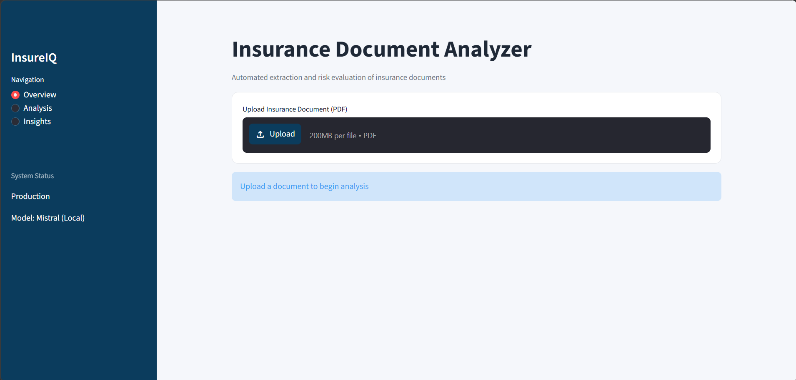
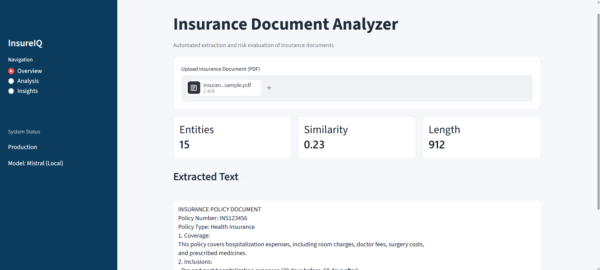
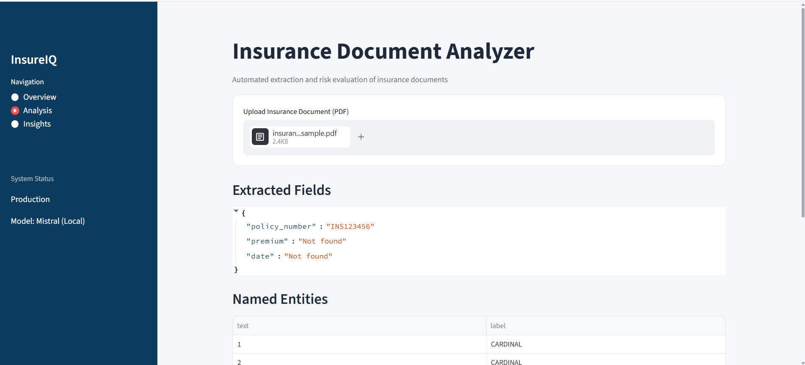
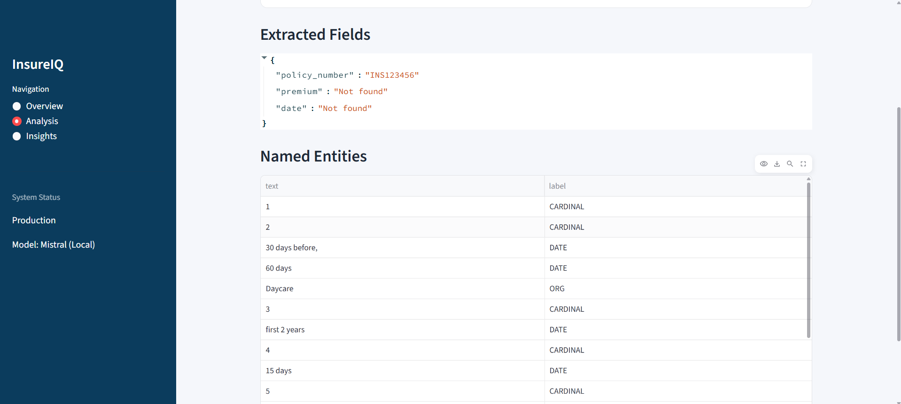
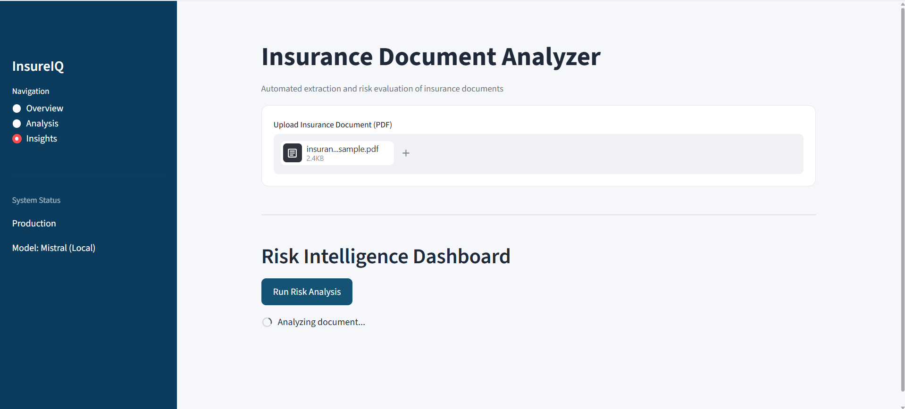
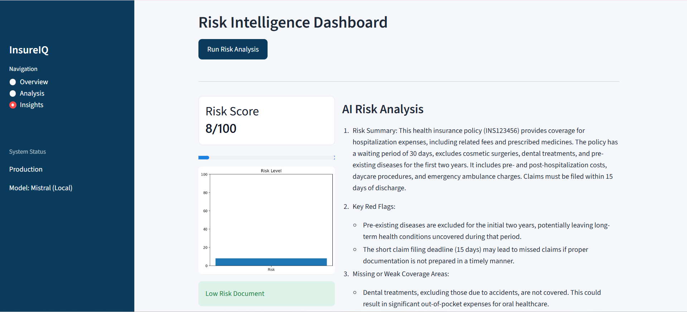
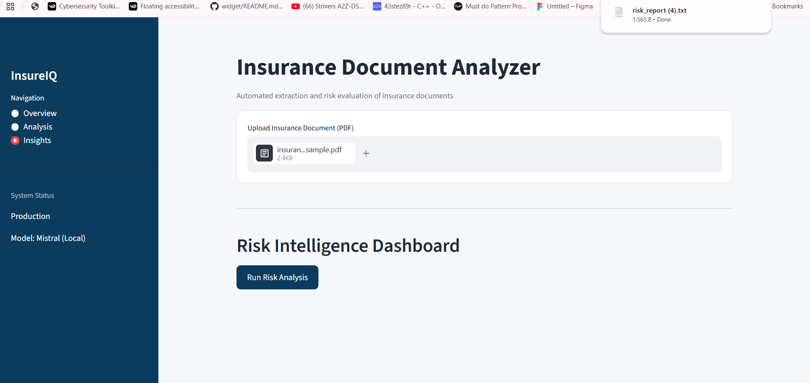

# InsureIQ – AI-Powered Insurance Document Analyzer

InsureIQ is an application designed to analyze insurance policy documents using natural language processing and retrieval-based techniques. It enables users to upload policy documents and interact with them through natural language queries, facilitating efficient extraction of relevant information from unstructured text.

---

## Features

- Upload and process insurance policy documents in PDF format  
- Perform semantic search using FAISS for efficient information retrieval  
- Query documents using natural language  
- Generate context-aware responses using a local language model (Ollama)  
- Extract key policy details such as coverage, exclusions, and claim conditions  
- Provide downloadable outputs including summaries and extracted insights  

---

## Technology Stack

- Python  
- Streamlit  
- FAISS  
- SentenceTransformers  
- Ollama (Local Language Model)  
- pdfplumber  

---

## Application Screenshots

### Dashboard Overview


### Document Upload Interface


### Chat Interface


### Analysis Panel


### Insights Panel


### Summary Output with Dashboard


### Document of Results



---

## Project Structure
```
InsureIQ/
│
├── app.py               # Streamlit frontend & main entry point
├── rag.py               # RAG pipeline — retrieval + generation
├── utils.py             # Helper functions
├── ollama_utils.py      # Local LLM integration via Ollama
├── requirements.txt     # Python dependencies
└── images/              # Screenshots and assets
``` 
* Understanding complex clauses in simple language  
* Query-based document exploration  
* Decision support for insurance-related queries  
* Quick insights from lengthy documents  

---

## 9. Setup Instructions

### Prerequisites

* Python 3.8+  
* Ollama installed locally  
* Streamlit installed  

---

### Steps

1. Clone the repository  
2. Install dependencies:


pip install -r requirements.txt


3. Start the local LLM:


ollama run llama3


4. Run the application:


streamlit run app.py


5. Open in browser and upload a PDF  

---

## 10. Key Learnings

* Implementing Retrieval-Augmented Generation (RAG)  
* Working with vector databases (FAISS)  
* Generating embeddings using SentenceTransformers  
* Building interactive apps using Streamlit  
* Running local LLMs using Ollama  
* Handling unstructured PDF data  

---

## 11. Future Enhancements

* Multi-document comparison  
* Support for DOCX and other file formats  
* Authentication and user sessions  
* Cloud deployment (AWS / GCP)  
* Advanced analytics dashboard  
* Improved UI/UX with better visualization  

---

## 12. Author

**Prisha F**  
GitHub: https://github.com/prishaf
